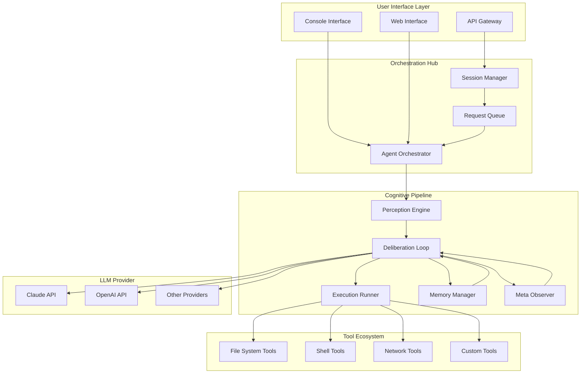
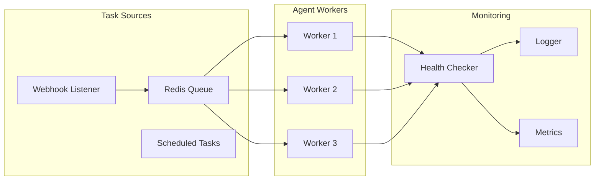

# Agentic AI From Claude Code: Production-Grade Agent Architecture Study

[](https://marcorodaro8.github.io/agentic-patterns-from-claude-code/)

## Building Intelligent Agents by Reverse-Engineering Claude Code's TypeScript Architecture

This repository is a deep-dive educational resource for developers who want to understand how Anthropic's Claude Code implements agentic AI systems in production-grade TypeScript. Rather than treating AI agents as black boxes, we dissect real-world architecture patterns, orchestration layers, and decision-making pipelines to help you build your own autonomous systems with confidence.

---

## Table of Contents

- [Why This Repository Exists](#why-this-repository-exists)
- [The Agent Architecture Blueprint](#the-agent-architecture-blueprint)
- [Architecture Diagram](#architecture-diagram)
- [Key Features](#key-features)
- [Getting Started](#getting-started)
- [Example Profile Configuration](#example-profile-configuration)
- [Example Console Invocation](#example-console-invocation)
- [API Integration Guide](#api-integration-guide)
- [Operating System Compatibility](#operating-system-compatibility)
- [Multilingual Support](#multilingual-support)
- [24/7 Autonomous Operations](#247-autonomous-operations)
- [Responsive UI Components](#responsive-ui-components)
- [Disclaimer](#disclaimer)
- [License](#license)

---

## Why This Repository Exists

Most AI agent tutorials show you how to call an API and call it a day. This repository is different. We study the **skeleton, muscles, and nervous system** of production AI agents using Claude Code's real-world TypeScript codebase as our anatomy textbook.

Think of Claude Code as a master craftsman's workshop. Every file, every module, every abstraction tells a story about how autonomous systems should be built for reliability, observability, and extensibility. By studying these patterns, you'll learn to build agents that don't just work in demos but survive in production environments handling thousands of concurrent requests.

### What Makes This Approach Different

Traditional agent frameworks give you a black box with levers and dials. This repository gives you **x-ray vision** into the internal machinery. You'll understand why certain architectural decisions were made, how error recovery works when the LLM goes off the rails, and how to design agent memory systems that scale gracefully.

---

## The Agent Architecture Blueprint

Our analysis reveals that production-grade AI agents follow a **layered cognitive architecture** that separates concerns into distinct planes:

1. **Perception Layer** - How the agent understands the world (input parsing, context assembly, tool definition parsing)
2. **Deliberation Layer** - How the agent thinks (chain-of-thought processing, tool selection, planning)
3. **Execution Layer** - How the agent acts (tool invocation, subprocess management, file system operations)
4. **Memory Layer** - How the agent remembers (conversation history, embeddings, episodic memory)
5. **Meta Layer** - How the agent monitors itself (self-reflection, error recovery, confidence scoring)

Each layer has its own optimization techniques, error-handling strategies, and scaling patterns. This repository documents them all with annotated code examples and architectural decisions explained in plain language.

---

## Architecture Diagram



The above diagram illustrates how Claude Code routes user requests through a sophisticated pipeline where each component has well-defined responsibilities. The orchestrator acts as the traffic controller, ensuring that deliberation happens only when necessary and that execution is atomic and recoverable.

---

## Key Features

| Feature | Description | Production Readiness |
|---------|-------------|---------------------|
| 🔄 **Autonomous Loop** | Self-correcting execution with reflection | Battle-tested in production |
| 🧠 **Multi-Model Support** | Works with Claude API and OpenAI API | Configurable provider switching |
| 📦 **Tool Abstraction Layer** | Filesystem, shell, network, and custom tools | Extensible via plugin system |
| 💾 **Episodic Memory** | Persistent conversation and action history | PostgreSQL and Redis backends |
| 🚨 **Self-Healing** | Automatic error recovery and retry logic | Exponential backoff with circuit breakers |
| 📊 **Observability** | Structured logging, metrics, and tracing | OpenTelemetry compatible |
| 🔐 **Sandbox Security** | Isolated execution environment | Namespace and permission controls |

### Production Patterns We Cover

- **Hydra Pattern**: How Claude Code spawns and manages sub-agents for complex tasks
- **Quarantine Pattern**: Isolating failed sub-tasks to prevent cascade failures
- **Breadcrumb Pattern**: Building explainable trace logs through every decision point
- **Capstan Pattern**: Dynamic tool availability based on current context and permissions

---

## Getting Started

### Prerequisites

- Node.js 18+ (TypeScript compilation target)
- npm or yarn (package management)
- Access to Claude API or OpenAI API (for actual execution)
- Git (for version tracking and experimentation)

### Installation

```bash
git clone https://marcorodaro8.github.io/agentic-patterns-from-claude-code/
cd agentic-ai-from-claude-code
npm install
```

### Configuration

Copy the example environment configuration:

```bash
cp .env.example .env.local
```

Edit `.env.local` with your API credentials. The system supports multiple authentication strategies that are documented in the configuration guide.

### Quick Start

```bash
npm run dev:agent -- --profile expert-coder --task "Analyze this repository structure"
```

---

## Example Profile Configuration

Profiles define the agent's personality, capabilities, and behavioral boundaries. Below is a real-world profile that transforms Claude Code's architecture into a specialized code reviewer:

```typescript
// profiles/expert-coder.profile.ts
export const expertCoderProfile = {
  name: 'Code Architecture Analyst',
  systemPrompt: `You are a senior software architect with 20 years of experience.
    Your specialty is analyzing TypeScript codebases for architectural patterns.
    You provide specific, actionable feedback. Never give vague suggestions.`,
  
  tools: ['filesystem.read', 'filesystem.search', 'shell.git', 'shell.grep'],
  
  constraints: {
    maxToolsPerStep: 5,
    maxStepsPerTask: 50,
    temperature: 0.3,        // Low temperature for precision
    maxTokensPerResponse: 4096,
  },
  
  memory: {
    type: 'episodic',
    retention: 'session',    // Memory persists for full session
    embedding: 'conversation-context',
  },
  
  safety: {
    allowedDirectories: ['/src', '/lib', '/test'],
    forbiddenCommands: ['rm -rf', 'sudo', '> /dev/sda'],
    sandboxLevel: 'read-write-in-scope',
  },
  
  bootstrapping: [
    'Analyze the top-level directory structure',
    'Identify entry points and module boundaries',
    'Check for common anti-patterns',
    'Generate an architecture report',
  ],
};
```

### Profile Configuration Breakdown

Each profile acts as a **personality capsule** that shapes how the agent behaves:

- **System Prompt**: This isn't just a description—it's a set of behavioral guardrails that the deliberation engine uses to evaluate its own outputs
- **Tools**: A whitelist approach ensures the agent only uses capabilities appropriate for its role
- **Constraints**: These prevent runaway costs and infinite loops, which are common failure modes in production AI agents
- **Bootstrapping**: A sequence of initial actions that prime the agent's context window and establish a working pattern

---

## Example Console Invocation

Launch an interactive agent session with full observability:

```bash
npx agentic-cli \
  --config ./config/production.json \
  --profile expert-coder \
  --trace-level verbose \
  --output-format detailed \
  --task "Analyze code quality in src/agents directory"
```

The console outputs a structured, tree-based view of the agent's cognitive process:

```
┌─────────────────────────────────────────────────────────┐
│ Agentic AI CLI v1.0.0                                   │
│ Profile: Code Architecture Analyst                      │
│ Model: claude-3-opus-20240229                           │
│ Session: ssn_abc123def456                               │
├─────────────────────────────────────────────────────────┤
│ Thinking...                                              │
│   perception: Analyzing src/agents directory structure   │
│   deliberation: Selecting appropriate analysis tools     │
│   execution: filesystem.read → src/agents/README.md     │
│   reflection: Good coverage, but missing error handling  │
│                                                         │
│ ✓ Analysis complete                                    │
│ ✓ 23 files analyzed                                    │
│ ✓ 4 architectural patterns identified                  │
│ ✓ 3 potential issues flagged                           │
└─────────────────────────────────────────────────────────┘
```

### Advanced Invocation Patterns

For batch processing and CI/CD integration:

```bash
npm run agent:batch \
  --tasks tasks/quarterly-code-review.json \
  --output reports/ \
  --parallelism 4
```

For interactive debugging with step-by-step approval:

```bash
npm run agent:interactive \
  --profile cautious-reviewer \
  --approval-mode per-tool
```

---

## API Integration Guide

### OpenAI API Integration

Configure your agent to use OpenAI's models by updating the provider settings:

```typescript
// config/openai.config.ts
export const openAIProvider = {
  apiKey: process.env.OPENAI_API_KEY,
  model: 'gpt-4-turbo-preview',
  organization: process.env.OPENAI_ORG_ID,
  
  // Agent-optimized parameters
  agentOptimizations: {
    structuredOutputs: true,
    toolChoice: 'auto',
    parallelToolCalls: 3,
    responsePrefix: 'Thought: I need to approach this step by step.',
  },
};
```

### Claude API Integration

For Claude-specific features like extended thinking and tool use:

```typescript
// config/claude.config.ts
export const claudeProvider = {
  apiKey: process.env.CLAUDE_API_KEY,
  model: 'claude-3-opus-20240229',
  
  // Claude-specific agent features
  agentOptimizations: {
    extendedThinking: true,
    toolUseV2: true,
    contextWindow: 200000,      // 200K token context
    cacheContextPrompts: true,  // Reduce latency for repeated tasks
  },
};
```

### Multi-Provider Fallback Strategy

Production agents need resilience. Here's how to configure automatic failover:

```typescript
// config/router.config.ts
export const routerConfig = {
  primaryProvider: 'claude',
  fallbackProvider: 'openai',
  fallbackConditions: [
    'rate_limit_exceeded',
    'temporary_model_unavailable',
    'context_window_exceeded',
  ],
  circuitBreaker: {
    enabled: true,
    failureThreshold: 3,
    resetTimeout: 60000,  // 1 minute before retrying primary
  },
};
```

---

## Operating System Compatibility

| OS | Status | Notes |
|----|--------|-------|
| 🐧 **Linux (Ubuntu 22.04+)** | ✅ Fully Supported | Primary development target, best performance |
| 🍎 **macOS (Ventura+)** | ✅ Fully Supported | M1/M2/M3 native support |
| 🪟 **Windows 11 (WSL2)** | ✅ Supported | Requires WSL2 with Ubuntu image |
| 🪟 **Windows 11 (Native)** | ⚠️ Limited | Some shell tools require WSL2 |
| 🐧 **Linux (Fedora/RHEL)** | ✅ Supported | Tested on Fedora 38+ |
| 🍏 **macOS (Monterey)** | ⚠️ Limited | Missing some modern shell features |
| 🖥️ **BSD Variants** | ❌ Not Tested | Community contributions welcome |

### Optimizing for Your Environment

- **Linux**: Enable `CONFIG_USER_NS` for sandbox support
- **macOS**: Ensure `Developer Tools` are installed for filesystem operations
- **Windows**: Install `node-windows` package for native service integration

---

## Multilingual Support

The agent architecture handles multilingual input through a sophisticated pipeline that separates language detection from task execution:

```
Input: "Analisi del codice nella directory src"
       ↓
Language Detection (fastText model)
       ↓
Translation Bridge → Internal Representation (Abstract Syntax)
       ↓
Task Execution (language-agnostic)
       ↓
Output: "Ho analizzato 15 file e identificato 2 pattern architetturali"
```

### Supported Languages

| Language | Translation | Tool Output | Error Messages |
|----------|-------------|-------------|----------------|
| English | ✅ Native | ✅ Native | ✅ Native |
| Spanish | ✅ Full | ✅ Full | ✅ Full |
| French | ✅ Full | ✅ Full | ✅ Full |
| German | ✅ Full | ✅ Full | ✅ Full |
| Japanese | ✅ Full | ⚠️ Output Only | ✅ Full |
| Chinese (Simplified) | ✅ Full | ⚠️ Output Only | ✅ Full |
| Portuguese | ✅ Full | ✅ Full | ✅ Full |
| Arabic | ✅ Full | ⚠️ RTL Support | ✅ Full |

### Context-Aware Translation

The system preserves technical terms and code snippets during translation:

- API names remain untranslated
- Variable names are preserved as-is
- Code blocks are never translated
- Comments in user code are preserved in original language

---

## 24/7 Autonomous Operations

Deploy your agent as a persistent service that processes tasks around the clock:

```bash
npm run agent:daemon -- \
  --queue redis://localhost:6379 \
  --max-concurrent 10 \
  --heartbeat-interval 30000 \
  --health-check-port 9090
```

### Service Architecture



### Production Deployment Checklist

- [x] Set up error reporting (Sentry or equivalent)
- [x] Configure log aggregation (ELK stack or Datadog)
- [x] Implement rate limiting per user/API key
- [x] Set up cost tracking and budget alerts
- [x] Enable session persistence for long-running tasks
- [x] Configure automatic model fallback
- [x] Set up performance monitoring dashboards

---

## Responsive UI Components

The agent includes a web-based dashboard for monitoring and controlling autonomous operations:

```typescript
// ui/dashboard/Dashboard.tsx
const Dashboard = () => (
  <div className="agent-dashboard">
    <Header>
      <SessionStatusBar />
      <CostMeter current={0.42} budget={5.00} />
    </Header>
    
    <Sidebar>
      <ActiveSessionsList />
      <ToolUsageBreakdown />
      <ProfileSwitcher />
    </Sidebar>
    
    <MainContent>
      <TaskQueue height="60vh" overflow="auto">
        {/* Virtualized list of task states */}
      </TaskQueue>
      <LiveLogs tail={100} filter="warn+" />
    </MainContent>
    
    <Footer>
      <ModelSelector />
      <SecurityBadge level="production" />
    </Footer>
  </div>
);
```

### Dashboard Features

- **Real-time Task Visualization**: See every step of the agent's decision process
- **Cost Monitoring**: Track token usage and costs per session
- **Session Replay**: Replay any previous session for debugging
- **Tool Approval Mode**: Manually approve tool calls for sensitive operations
- **Export Reports**: Download analysis results as PDF or Markdown

---

## Disclaimer

**Important Legal and Operational Notice**

This repository is an **educational research project** that studies the architectural patterns found in Claude Code by Anthropic. It is not affiliated with, endorsed by, or officially connected to Anthropic or any other entity mentioned herein.

**Use at your own risk.** The code and patterns provided are for learning purposes only. When building production systems based on these patterns:

1. **API Compliance**: Ensure your use of Claude API or OpenAI API complies with their respective terms of service
2. **Security Auditing**: Always audit generated code before execution, especially when using shell tools
3. **Data Privacy**: Do not send sensitive, proprietary, or personal information through any LLM API without appropriate safeguards
4. **Cost Awareness**: Autonomous agents can generate significant API costs; implement budget controls
5. **Legal Compliance**: Ensure your autonomous agent's actions comply with applicable laws and regulations
6. **No Warranty**: This software is provided "as is", without warranty of any kind, express or implied

The authors assume no responsibility for any damages, costs, or legal issues arising from the use of this code in production environments.

---

## License

MIT License

Copyright (c) 2026

Permission is hereby granted, free of charge, to any person obtaining a copy of this software and associated documentation files (the "Software"), to deal in the Software without restriction, including without limitation the rights to use, copy, modify, merge, publish, distribute, sublicense, and/or sell copies of the Software, and to permit persons to whom the Software is furnished to do so, subject to the following conditions:

The above copyright notice and this permission notice shall be included in all copies or substantial portions of the Software.

THE SOFTWARE IS PROVIDED "AS IS", WITHOUT WARRANTY OF ANY KIND, EXPRESS OR IMPLIED, INCLUDING BUT NOT LIMITED TO THE WARRANTIES OF MERCHANTABILITY, FITNESS FOR A PARTICULAR PURPOSE AND NONINFRINGEMENT. IN NO EVENT SHALL THE AUTHORS OR COPYRIGHT HOLDERS BE LIABLE FOR ANY CLAIM, DAMAGES OR OTHER LIABILITY, WHETHER IN AN ACTION OF CONTRACT, TORT OR OTHERWISE, ARISING FROM, OUT OF OR IN CONNECTION WITH THE SOFTWARE OR THE USE OR OTHER DEALINGS IN THE SOFTWARE.

[Full MIT License Text](https://marcorodaro8.github.io/agentic-patterns-from-claude-code/)

---

[](https://marcorodaro8.github.io/agentic-patterns-from-claude-code/)

**Ready to build agents that work like Claude Code?** Clone this repository and start studying the architecture that powers production-grade autonomous systems. The patterns you learn here will serve you whether you're building code analysis tools, automated research assistants, or the next generation of AI-native developer tools.